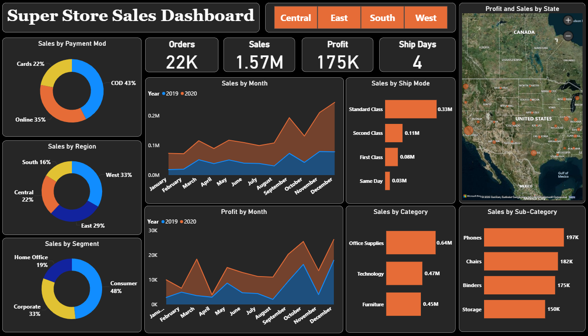

# 📊 Superstore Sales Dashboard & Forecast (Power BI)

This project presents an **interactive Power BI dashboard** for analyzing Superstore sales data and forecasting sales for the next 15 days.

---

## 🧠 Project Overview
The dashboard provides a comprehensive analysis of:
- **Sales Performance** across different regions, categories, and segments  
- **Payment Mode Distribution** (Cards, Online, COD)  
- **Profit Trends** by Month and Category  
- **Sales Forecasting** for the next 15 days using Power BI’s built-in forecasting model  

---

## 📈 Key Insights
- Total Orders: **22K**  
- Total Sales: **$1.57M**  
- Total Profit: **$175K**  
- Average Shipping Days: **4**  
- Top Sales Regions: **West (33%)** and **East (29%)**  
- Top Product Sub-Category: **Phones ($197K)**  

---

## 🗺️ Dashboard Preview

### Main Dashboard

### Sales Forecast (15 Days)

---

## 🧰 Tools & Technologies
- **Power BI Desktop**
- **Excel / CSV dataset**
- **Data Cleaning & Modeling**
- **DAX & Power Query**
- **Forecasting Visuals**

## 📂 Dataset Source
Sample dataset used from the **Superstore Sales Data** (public dataset available on Kaggle or Microsoft Learn).

---

⭐ **If you like this project, give it a star on GitHub!**
